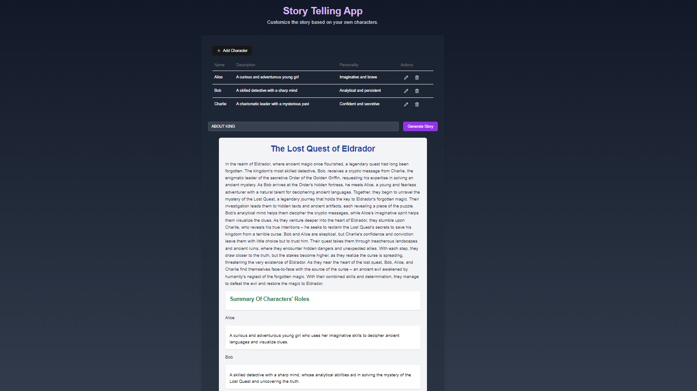

# Story Generator - Encode Club AI Bootcamp Week 3 Project
[Live Demo](https://storywriter-w3.vercel.app/)
#


## Project Description
The Story Generator is an interactive web application built with NextJS that allows users to create custom characters and generate stories using AI. Users can add, edit, and delete characters with attributes such as name, description, and personality. The AI will then generate a story incorporating the user-created characters and provide a summary of each character's role in the story.

This project is designed to experiment with different AI models to generate stories and observe how well the models "remember" user-created characters. We also compare different context window sizes across models to analyze their impact on the generated output.

## Features
- Add, edit, and delete custom characters with attributes: name, description, and personality.
- AI-powered story generation using user-created characters.
- Summary of each character's role in the story after full text generation.
- Experimentation with different AI models and context window sizes.
- Model comparison based on story generation quality and character memory.

## How to Use
1. **Visit the Story Generator Website.**
2. **Add New Characters:**
   - Navigate to the "Characters" section.
   - Click the "Add Character" button.
   - Fill in the character's name, description, and personality.
   - Save the character.
3. **Edit or Delete Characters:**
   - Select a character from the list.
   - Choose to either edit the character's details or delete the character.
4. **Generate a Story:**
   - Go to the "Story Generator" section.
   - Customize the prompt (optional) to include your created characters.
   - Click the "Generate Story" button.
   - Read the generated story and view the summary of each character's role in the story.
5. **Experiment with Different Models:**
   - Select a different AI model and observe how well it remembers the characters.
   - Test various context window sizes to analyze their impact on the generated output.

## Local Development
To run this project locally, follow these steps:

```bash
# Clone the repository
git clone git@github.com:Shabbir-Anjum/Encode_Club-AI-Boot-camp-week-3-Project.git

# Navigate to the project directory
cd Encode_Club-AI-Boot-camp-week-3-Project

# Install dependencies
npm install

# Set up environment variables:
# Create a .env.local file in the root directory
# Add your AI API key
GROQ_API_KEY=your_api_key_here

# Run the development server
npm run dev

# Open http://localhost:3000 in your browser to see the application.
